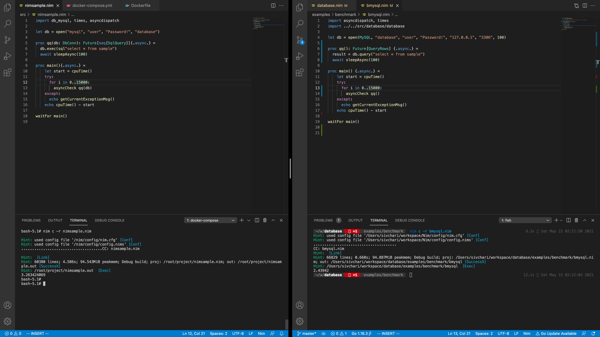
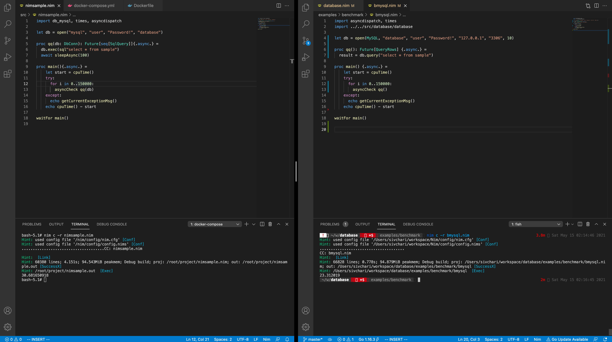
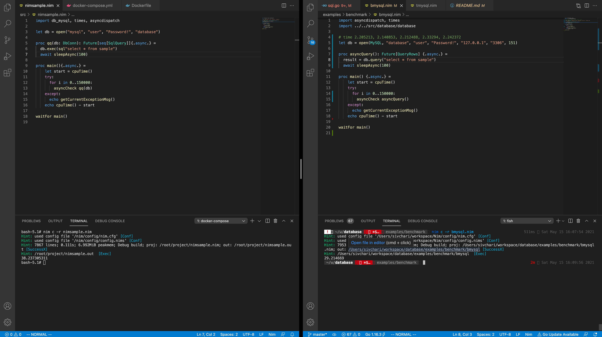

# database

[](https://github.com/sivchari/database/actions/workflows/nim_test.yml)
[](https://github.com/sivchari/database)

database provides intuitive DB methods.  
Just by using this library, you can use MySQL, PostgreSQL, and SQLite.  
By using connection pooling, parallel DB processing can be done at high speed.

## Installation
```shell
nimble install https://github.com/sivchari/database
```

## Example
### MySQL
```nim
import database

let db = open(MySQL, "database", "user", "Password!", "127.0.0.1", "3306", 10)
echo db.ping

echo "insert"
discard db.query("INSERT INTO sample(id, age, name) VALUES(?, ?, ?)", 1, 10, "New Nim")

echo "select"
let row1 = db.query("SELECT * FROM sample WHERE id = ?", 1)
let row2 = db.prepare("SELECT * FROM sample WHERE id = ?").query(1)

echo row1.all
echo row1[0]
echo row1.columnTypes
echo row1.columnNames

echo row2.all
echo row2[0]
echo row2.columnTypes
echo row2.columnNames

echo "update"
let stmt1 = db.prepare("UPDATE sample SET name = ? WHERE id = ?")
discard stmt1.exec("Change Nim", 1)

echo "delete"
let stmt2 = db.prepare("DELETE FROM sample WHERE id = ?")
discard stmt2.exec(1)

db.transaction:
  let stmt3 = db.prepare("UPDATE sample SET name = ? WHERE id = ?")
  discard stmt3.exec("Rollback Nim", 1)
  raise newException(Exception, "rollback")

discard db.close
```

### PostgreSQL
```nim
import database

let db = open(PostgreSQL, "database", "user", "Password!", "127.0.0.1", "5432", 1)
echo db.ping

echo "insert"
discard db.query("INSERT INTO sample(id, age, name) VALUES($1, $2, $3)", 1, 10, "New Nim")

echo "select"
let row1 = db.query("SELECT * FROM sample WHERE id = $1", 1)
let row2 = db.prepare("SELECT * FROM sample WHERE id = $1").query(1)

echo row1.all
echo row1[0]
echo row1.columnTypes
echo row1.columnNames

echo row2.all
echo row2[0]
echo row2.columnTypes
echo row2.columnNames

echo "update"
let stmt1 = db.prepare("UPDATE sample SET name = $1 WHERE id = $2")
discard stmt1.exec("Change Nim", 1)

echo "delete"
let stmt2 = db.prepare("DELETE FROM sample WHERE id = $1")
discard stmt2.exec(1)

db.transaction:
  let stmt3 = db.prepare("UPDATE sample SET name = $1 WHERE id = $2")
  discard stmt3.exec("Rollback Nim", 1)
  raise newException(Exception, "rollback")

discard db.close
```

### SQLite
```nim
import database

let db = open(SQLite3, "sample.sqlite3")
echo db.ping

let cmd = """CREATE TABLE IF NOT EXISTS sample (
     id INT
    ,age INT
    ,name VARCHAR
)"""

discard db.query(cmd)

echo "insert"
discard db.query("INSERT INTO sample(id, age, name) VALUES(?, ?, ?)", 1, 10, "New Nim")

echo "select"
let row1 = db.query("SELECT * FROM sample WHERE id = ?", 1)
let row2 = db.prepare("SELECT * FROM sample WHERE id = ?").query(1)

echo row1.all
echo row1[0]
echo row1.columnTypes
echo row1.columnNames

echo row2.all
echo row2[0]
echo row2.columnTypes
echo row2.columnNames

echo "update"
let stmt1 = db.prepare("UPDATE sample SET name = ? WHERE id = ?")
discard stmt1.exec("Change Nim", 1)

echo "delete"
let stmt2 = db.prepare("DELETE FROM sample WHERE id = ?")
discard stmt2.exec(1)

discard db.close
```

## Cross Compile

### Mac
```shell
GOARCH=arm64 CGO_ENABLED=1 go build -buildmode=c-shared -o sql_arm64.so *.go
GOARCH=amd64 CGO_ENABLED=1 go build -buildmode=c-shared -o sql_amd64.so *.go
```

### Linux
```shell
docker-compose up --build -d linux-compile
docker-compose exec linux-compile bash
cd src/database-resource/
go get golang.org/dl/go1.16
go1.16 download
GOOS=linux GOARCH=amd64 CGO_ENABLED=1 go1.16 build -buildmode=c-shared -o sql_linux_amd64.so *.go
```

### Windows
```shell
docker-compose up --build -d windows-compile
docker-compose exec windows-compile bash
cd src/database-resource/
apt -y update
apt -y install gcc-mingw-w64
apt -y install binutils-mingw-w64
GOOS=windows GOARCH=amd64 CGO_ENABLED=1 CXX=x86_64-w64-mingw32-g++ CC=x86_64-w64-mingw32-gcc go build -buildmode=c-shared -o sql_windows_amd64.dll *.go
```

## Benchmark

There is an official database library for Nim, but it does not implement connection pooling.
However, this library (database) allows connection pooling to be set at connection time.
This library (database) implicitly sets the same value as the connection pool as idle connection when connecting.

`There is a 9 second difference in performance between db_mysql and db_mysql for 150,000 queries issued.`

Here is a benchmark of the official db_mysql and 15000 queries and 150000 run with async

## Loop 15000


### db_mysql
> 3.263424069 sec

### database
> 2.4392 sec

The reason why only the standard library calls sleep in the 150000 loop is because the standard library does not support concurrency and will execute another query before the query is completed.

Here is the error message

```shell
commands out of sync; you can't run this command now
```

## Loop 150000


### db_mysql
> 30.681650918 sec

### database
> 23.312019 sec

## If you put async in both cases


### db_mysql
> 38.237305311 sec

### database
> 29.214669 sec
